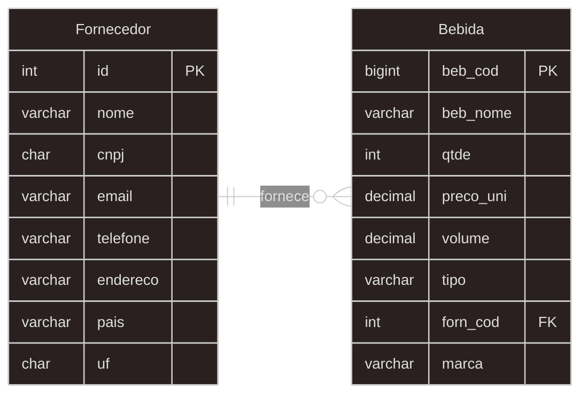

# CrudLP
Para instalar dependencias
```
cd backend; pnpm install
```
ou
```
cd backend; npm install
```

E para executar o servidor
```
cd backend; node src/app.js
```
para versões antigas do nodejs
```
cd backend; node dist/app.js
```

### Diagrama entidade relacionamento




