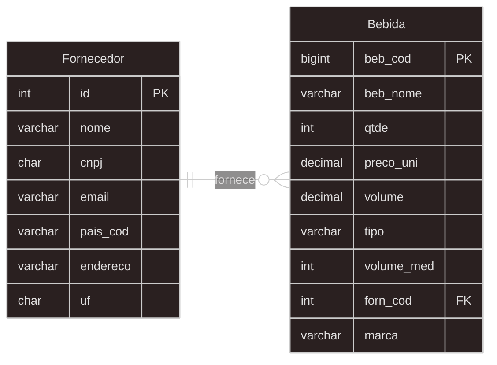

# CrudLP

### Diagrama entidade relacionamento

```mermaid
---
config:
  theme: neo-dark
---
erDiagram
	direction LR
	Fornecedor {
		int id PK ""  
		varchar nome  ""  
		char cnpj  ""  
		varchar email  ""  
		varchar pais_cod  ""  
		varchar endereco  ""  
		char uf  ""  
	}
	Bebida {
		bigint beb_cod PK ""  
		varchar beb_nome  ""  
		int qtde  ""  
		decimal preco_uni  ""  
		decimal volume  ""  
		varchar tipo  ""  
		int volume_med  ""  
		int forn_cod FK ""  
		varchar marca  ""  
	}

	Fornecedor||--o{Bebida:"fornece"

```

