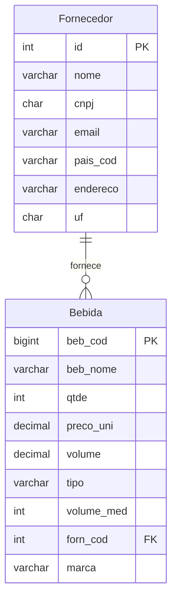

# CrudLP

### Diagrama entidade relacionamento

```mermaid
erDiagram
    Fornecedor ||--o{ Bebida : fornece

    Fornecedor {
        int id PK
        varchar nome
        char cnpj
        varchar email
        varchar pais_cod
        varchar endereco
        char uf
    }

    Bebida {
        bigint beb_cod PK
        varchar beb_nome
        int qtde
        decimal preco_uni
        decimal volume
        varchar tipo
        int volume_med
        int forn_cod FK
        varchar marca
    }
```

